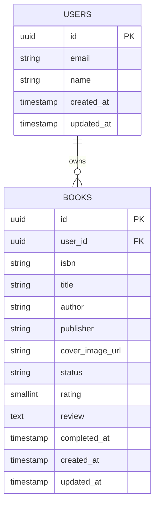

# ER図

## 全体



## テーブルの関係

* `USERS` 1人に対して、`BOOKS` は複数登録できる
* `BOOKS.user_id` が `USERS.id` を参照する
* 1冊の本は必ず1人のユーザーに紐づく
* ユーザーが退会した場合、そのユーザーの本をどう扱うかは別途検討する

## 認証

ユーザー認証は AWS Cognito を使用する。

`USERS.id` には Cognito User Pool の `sub` を保存する。

```text
Google
  ↓
Cognito
  ↓
Cognito sub
  ↓
USERS.id
```
